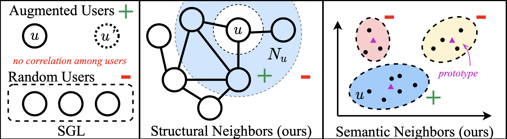

# NCL (Neighborhood-enriched Contrastive Learning)

This is the official PyTorch implementation for the [paper](https://arxiv.org/abs/2202.06200):
> Zihan Lin*, Changxin Tian*, Yupeng Hou* Wayne Xin Zhao. Improving Graph Collaborative Filtering with Neighborhood-enriched Contrastive Learning. WWW 2022.

## Overview

We propose a contrastive learning paradigm, named Neighborhood-enriched Contrastive Learning (**NCL**), to explicitly capture potential node relatedness into contrastive learning for graph collaborative filtering.

<div  align="center"> 

</div>

## Requirements

```
recbole==1.0.0
python==3.7.7
pytorch==1.7.1
faiss-gpu==1.7.1
```

## Quick Start

```bash
python main.py --dataset ml-1m
```

You can replace `ml-1m` to `yelp`, `amazon-books`, `gowalla-merged` or `alibaba` to reproduce the results reported in our paper.

## Datasets

For `alibaba`, you can download `alibaba.zip` from [Google Drive](https://drive.google.com/file/d/1Th7ii_Z0l6AjGq8zWsKuLVCsacIO1AQJ/view?usp=sharing). Then,
```bash
mkdir dataset
mv alibaba.zip dataset
unzip alibaba.zip
python main.py --dataset alibaba
```

For others, they will be downloaded automatically via RecBole once you run the main program. Take `yelp` for example,
```bash
python main.py --dataset yelp
```

## Customized datasets

To run NCL on customized datasets, please following https://github.com/RUCAIBox/NCL/issues/1#issuecomment-1076370560.

## Acknowledgement

The implementation is based on the open-source recommendation library [RecBole](https://github.com/RUCAIBox/RecBole).

Please cite the following papers as the references if you use our codes or the processed datasets.

```
@inproceedings{lin2022ncl,
    author={Zihan Lin and
            Changxin Tian and
            Yupeng Hou and
            Wayne Xin Zhao},
    title={Improving Graph Collaborative Filtering with Neighborhood-enriched Contrastive Learning},
    booktitle={{WWW}},
    year={2022},
}

@inproceedings{zhao2021recbole,
  title={Recbole: Towards a unified, comprehensive and efficient framework for recommendation algorithms},
  author={Wayne Xin Zhao and Shanlei Mu and Yupeng Hou and Zihan Lin and Kaiyuan Li and Yushuo Chen and Yujie Lu and Hui Wang and Changxin Tian and Xingyu Pan and Yingqian Min and Zhichao Feng and Xinyan Fan and Xu Chen and Pengfei Wang and Wendi Ji and Yaliang Li and Xiaoling Wang and Ji-Rong Wen},
  booktitle={{CIKM}},
  year={2021}
}
```
